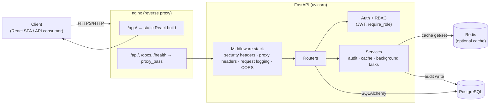
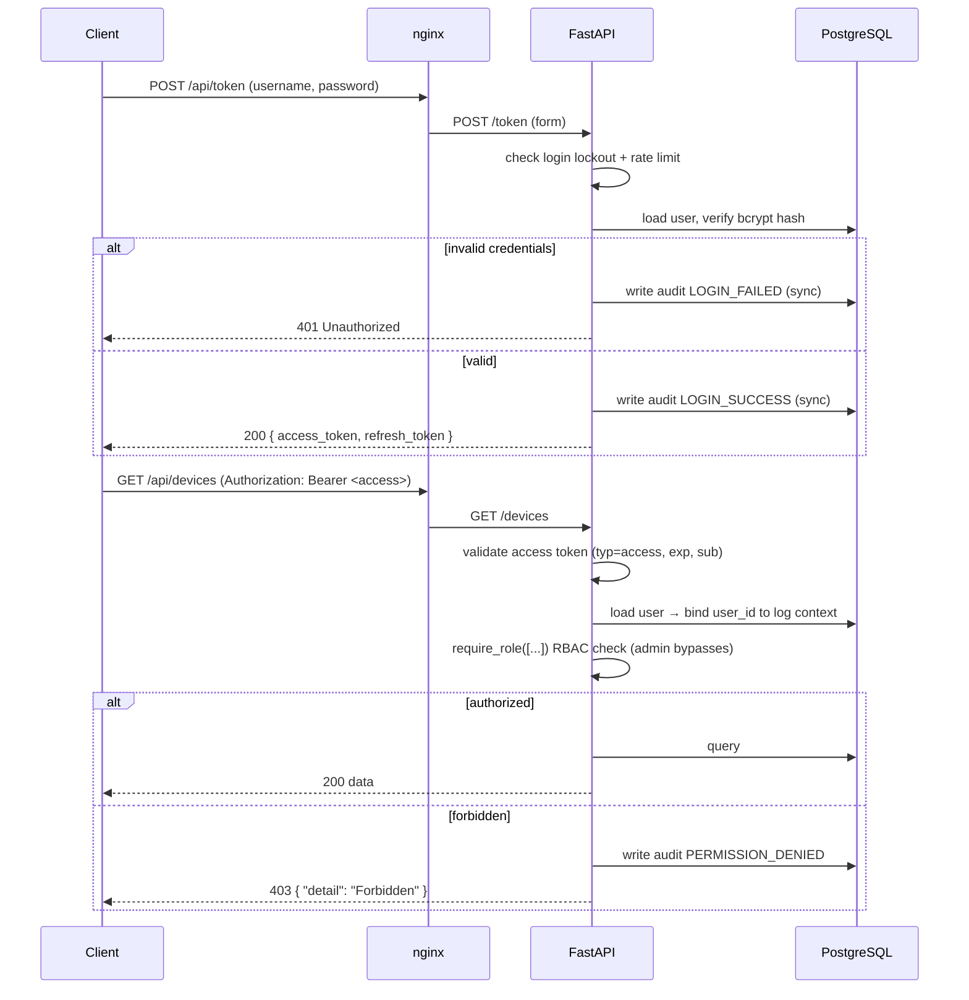
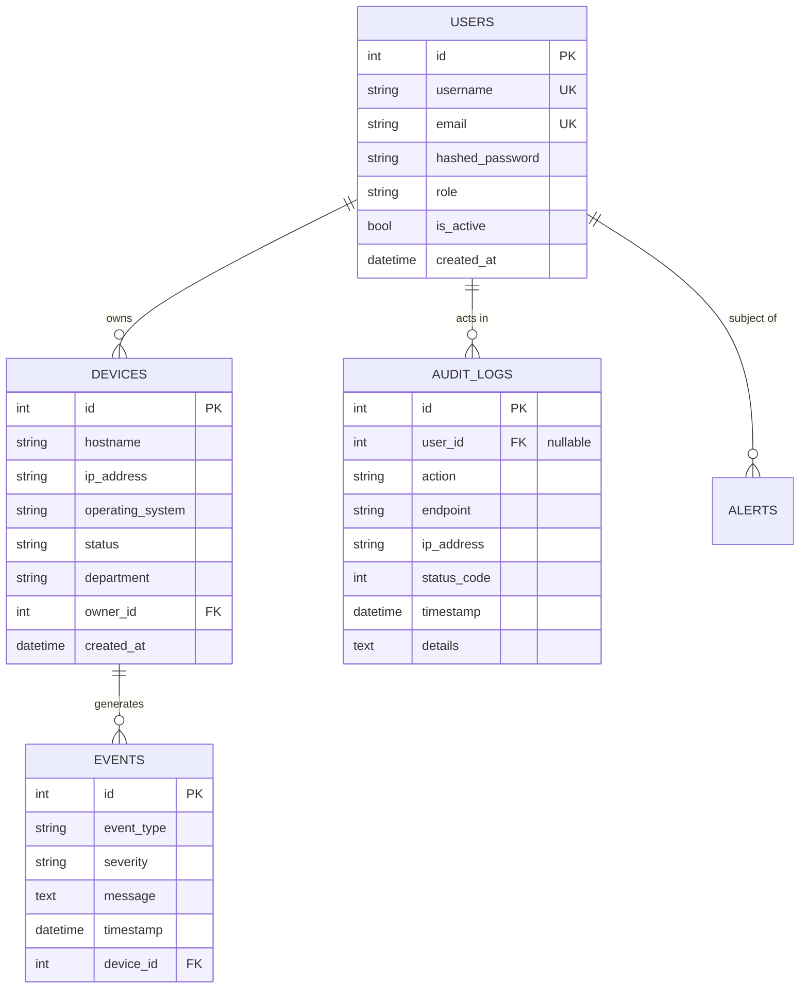

# Architecture

Nexventory is a production-style internal IT asset & security monitoring platform.
This document describes how the system is structured and how a request flows through it.

- **Backend:** FastAPI (Python 3.12), SQLAlchemy 2.0, PostgreSQL, Redis
- **Frontend:** React + Vite (served as static assets by nginx)
- **Edge:** nginx reverse proxy (TLS termination point, static hosting, API proxy)
- **Runtime:** Docker Compose locally and on a single EC2 host

---

## 1. Application structure

The API uses a **flat module layout** (`app/` is the import root; `uvicorn main:app`
runs from inside `app/`). Responsibilities are separated by layer:

```
app/
├── main.py              # App factory: middleware, routers, lifespan (create tables, Redis)
├── database.py          # Engine, SessionLocal, get_db() dependency, slow-query logging
├── logging_config.py    # Plaintext (dev) / JSON (prod) logging setup
├── routers/             # HTTP layer — one module per resource
│   ├── auth.py          #   /register, /token, /token/refresh, /users/me
│   ├── users.py         #   /users (admin)
│   ├── devices.py       #   /devices CRUD
│   ├── events.py        #   /events
│   ├── audit.py         #   /audit-logs (admin/analyst)
│   ├── dashboard.py     #   /dashboard/* aggregates
│   └── health.py        #   /health, /health/live, /health/ready
├── crud/                # Database access only (no HTTP) — device, event, user, audit, ...
├── models/              # SQLAlchemy ORM models (tables)
├── schemas/             # Pydantic request/response models + validators
├── auth/                # JWT handling, password hashing, RBAC dependencies, login lockout
├── services/            # Audit logging, caching, background tasks, dashboard aggregation
├── middleware/          # Request logging, security headers, centralized exception handlers
├── core/                # Settings, limiter, redis client, error envelope, request context
├── dependencies/        # Reusable query-param dependencies (pagination/filter/sort)
└── constants/           # Roles, audit action names, severities
```

**Layering rule:** `routers → crud → models`. Routers never write raw SQL; CRUD never
imports HTTP types beyond `HTTPException`. Pydantic schemas isolate the wire format from
the ORM so the database can evolve without breaking the API contract.

---

## 2. Component / deployment diagram



---

## 3. Authentication flow

JWT bearer authentication using the OAuth2 password flow (PyJWT, HS256).



- **Access tokens** are short-lived (default 15 min) and sent on every call.
- **Refresh tokens** are long-lived (default 7 days) and only accepted at `/token/refresh`.
- Tokens carry a `typ` claim (`access` / `refresh`) so a refresh token cannot be used as a bearer credential.
- Brute force is mitigated by per-IP/username **login lockout** plus **slowapi rate limits**.

---

## 4. Request lifecycle

1. **nginx** receives the request and either serves the static SPA (`/app/`) or proxies
   API paths to uvicorn (`/api/`, `/docs`, `/health`, ...). It forwards `X-Forwarded-*`.
2. **Middleware stack** (outermost → innermost): security headers → proxy headers →
   request logging → CORS. The request-logging middleware assigns/propagates an
   `X-Request-ID` and binds it (plus the user id, once authenticated) to a logging context.
3. **Dependencies** resolve: `get_db()` opens a scoped session; `get_current_active_user`
   validates the JWT; `require_role(...)` enforces RBAC.
4. **Router** delegates to **CRUD**; list endpoints run through cache-aware helpers and the
   standard `PaginatedResponse` envelope.
5. **Response** is serialized by Pydantic. Security-relevant actions schedule an **audit log**
   (background for mutations, synchronous for auth events).
6. **Errors** are caught by centralized exception handlers and returned as a single error
   envelope. The DB session is rolled back on failure; no stack trace reaches the client.

---

## 5. Database relationships



Composite indexes back the common list/dashboard query patterns (e.g.
`(status, created_at)` on devices, `(action, timestamp)` on audit logs).

---

## 6. Audit logging flow

Audit logging produces an append-only security trail (`audit_logs` table).

- **Synchronous** (`log_audit`): used for auth-critical events (login success/failure,
  lockout, invalid token, permission denied) so the record is committed even if the
  request ultimately fails.
- **Background** (`log_audit_background` → FastAPI `BackgroundTasks`): used for mutations
  (device/event created/updated/deleted, role updated) so the HTTP response returns before
  the write + cache invalidation run. Background tasks get their own DB session.

Each entry captures *who* (`user_id`, nullable for anonymous/failed attempts), *what*
(`action`), *where* (`endpoint`, `ip_address`), and the resulting `status_code`.

---

## 7. Observability

- **Structured logging:** JSON in production (`timestamp`, `level`, `logger`, `message`,
  plus contextual `request_id`, `user_id`, `method`, `endpoint`, `status`, `duration_ms`).
  Plaintext in development. Secrets/passwords/tokens are never logged.
- **Request correlation:** every response carries `X-Request-ID`; error envelopes include
  `request_id` for support.
- **Slow logging:** SQL slower than `SLOW_QUERY_MS` and HTTP slower than `SLOW_REQUEST_MS`
  are logged at WARNING.
- **Health probes:** `/health` (overall), `/health/live` (process), `/health/ready` (DB).

---

## 8. Deployment architecture

Single-host Docker Compose stack (local and EC2):

```
Internet ──▶ nginx:80  ──▶ api:8000 (uvicorn) ──▶ db:5432 (PostgreSQL)
                       └─▶ static React build (/app/)         └─▶ redis:6379 (cache)
```

Only nginx is published to the host. `api`, `db`, and `redis` communicate over the internal
Docker network. CI builds the image and the frontend, then deploys to EC2. See
[DEPLOYMENT.md](DEPLOYMENT.md) and [CICD.md](CICD.md).
