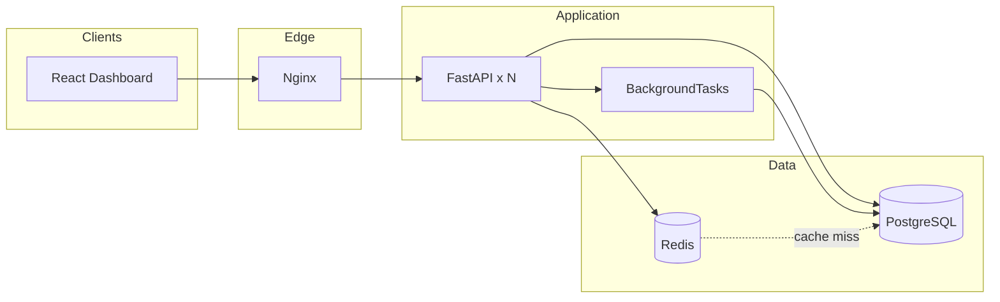

# Performance, caching, and scalability

## Architecture

```
Client → Nginx → FastAPI → Redis (optional cache) → PostgreSQL
                      ↘ BackgroundTasks (audit, invalidation)
```

| Layer | Role |
|-------|------|
| **Redis** | Response cache for dashboard aggregates and list endpoints |
| **PostgreSQL** | Source of truth; composite indexes for analytics |
| **BackgroundTasks** | Audit writes and cache invalidation after HTTP response |
| **Middleware** | Request duration + slow request warnings |
| **SQLAlchemy events** | Slow query logging (`SLOW_QUERY_MS`) |

Redis is **optional**: set `REDIS_ENABLED=false` or allow connection failure — the API falls back to PostgreSQL only.

## Redis setup (Docker)

Redis is defined in `docker-compose.yml` as service `redis`.

```powershell
docker compose --env-file .env.dev -f docker-compose.yml -f docker-compose.dev.yml up -d --build
```

| Variable | Default | Description |
|----------|---------|-------------|
| `REDIS_URL` | `redis://redis:6379/0` | Connection URL (use `redis://localhost:6379/0` on host) |
| `REDIS_ENABLED` | `true` | Set `false` to disable caching |
| `CACHE_TTL_DASHBOARD` | `120` | Dashboard overview / summary (seconds) |
| `CACHE_TTL_LIST` | `60` | Paginated list endpoints |
| `CACHE_TTL_STATS` | `300` | Inventory counters |
| `SLOW_QUERY_MS` | `500` | Log SQL slower than this |
| `SLOW_REQUEST_MS` | `1000` | Log HTTP slower than this |

### Cache keys

| Key pattern | Invalidated when |
|-------------|------------------|
| `dashboard:overview` | Device/event/alert/audit writes |
| `dashboard:security_summary` | Same |
| `list:devices:*` | Device create/update |
| `list:events:*` | Event create |
| `list:audit:*` | Audit log insert |

Logs:

```
CACHE HIT: dashboard:overview
CACHE MISS: list:devices:a1b2c3d4
```

## Background tasks

`POST /devices` returns **201** immediately; after the response:

1. Audit row is persisted (separate DB session)
2. Inventory cache keys are invalidated
3. Placeholder hook logs future notification/export jobs

Auth **failed login** paths still use **synchronous** audit so lockout logic and security trails stay consistent.

Future workers (Celery/RQ) can call the same functions in `services/background_tasks.py`.

## Database optimizations

| Area | Before | After | Benefit |
|------|--------|-------|---------|
| Dashboard overview | 6+ separate `COUNT(*)` on `audit_logs` | One `GROUP BY action` | Fewer round trips |
| Failed logins list | N+1 username lookup per IP | One batch query for all IPs | Scales with IP count |
| Pagination | `query.count()` on full ordered query | `COUNT(id)` without sort | Cheaper page metadata |

## Alembic migrations

From project root (with `DATABASE_URL` set):

```powershell
cd app
pip install -r requirements.txt
cd ..
alembic -c alembic.ini upgrade head
```

Docker:

```powershell
docker compose exec api sh -c "cd /app && alembic -c /alembic.ini upgrade head"
```

Note: mount or copy `alembic/` into the API image if you run migrations in-container (or run from CI against the DB URL).

## Async endpoints

| Async | Sync (kept) |
|-------|-------------|
| `/health`, `/health/ready` | Auth, CRUD mutations |
| `/dashboard/*` (DB via thread pool) | List/write routes using sync SQLAlchemy |

Sync SQLAlchemy in `async def` without `run_in_threadpool` would block the event loop — dashboard routes use the thread pool.

## Horizontal scaling notes

- **Stateless API** — scale `api` replicas behind nginx; share `SECRET_KEY` and DB.
- **Redis** — single instance or Redis Cluster for shared cache across replicas.
- **Login lockout** — still in-memory; use Redis for distributed lockout in a future phase.
- **BackgroundTasks** — per-process only; move to a queue for multi-replica audit guarantees.

## Architecture diagram (recommended)


